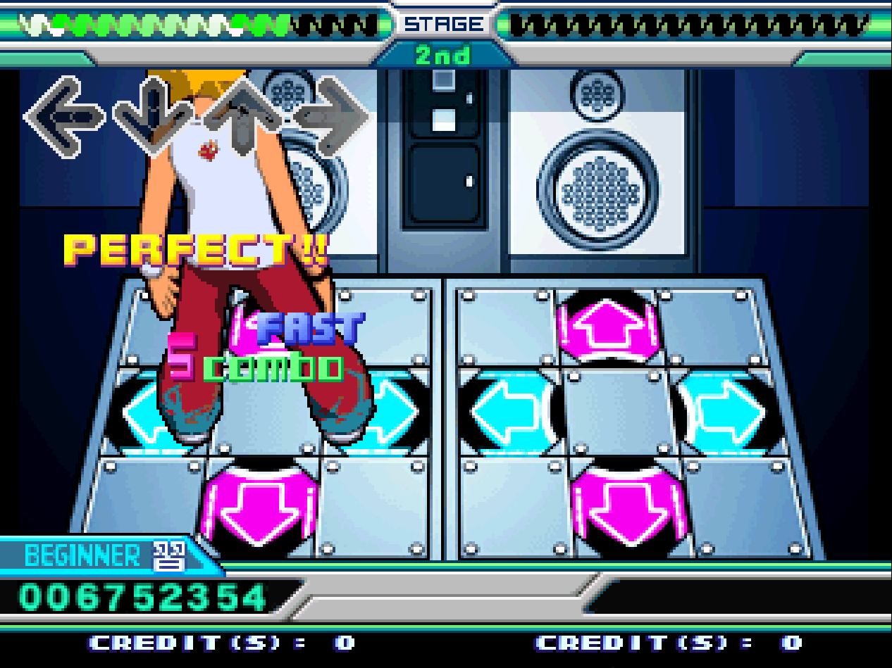

DDR EXTREME CLARITY
================================================================================



*DDR EXTREME CLARITY* is a mod for the game *Dance Dance Revolution EXTREME*
that adds "FAST" and "SLOW" judgment indicators to the in-game UI.

Relative timing indicators are complementary to verbal judgment indicators in 
almost all modern rhythm games. With the addition of "MARVELOUS" timing in 
*DDR EXTREME PRO*, this additional UI can assist players in achieving more 
accurate scoring in a version of the game that has famously had very strict 
timing.

Building
--------------------------------------------------------------------------------

Building the hack requires access to an existing game image. The hack can be
patched onto a vanilla version of *DDR EXTREME*, or it can be patched on top of
*DDR EXTREME PRO* by SurvivorTEAM. The only thing that is required is the
`GAME.DAT` file from the original game image. This is the only file that will be
patched.

The location of the `GAME.DAT` file within a game's disc image depends on the
version. In vanilla *DDR EXTREME*, this file is in the root directory of the
disc's filesystem in a file called `GAME.DAT`. In *DDR EXTREME PRO* or any other
"superdisc" release, this file is located in a subdirectory called `IN`, and is
named `8G` for vanilla *DDR EXTREME* or `8GP` in the case of *DDR EXTREME PRO*.

**NOTE**
In order to compile the game code, a 32-bit MIPS toolchain is required. For
this, the *Codescape GNU Toolchain* is recommended, which can be downloaded for
free here:

https://www.mips.com/develop/tools/compilers/

First, the game code comprising the feature must be compiled so that it can be
injected into the game image.

```
cd game-code
make
```

This will output two files into the `game-code/build` directory. Both of these
will be required for the next step.

Next, run the `add_clarity.py` script to patch an existing `GAME.DAT` game image
file. The paths to the replacement spritesheet image files, concatenated game
code payload, game code manifest, and the `GAME.DAT` game image file must all be
provided.

```
cd scripts
./add_clarity.py \
    --judgment-spritesheet ../../img/gmob_25_early_late.tim \
    --results-spritesheet ../../img/rslob_25_early_late.tim \
    --payload ../game-code/build/clarity.bin \
    --manifest ../game-code/build/manifest.json \
    <path-to-GAME-DAT>
```

After this has completed successfully, you now have a patched game image that
you can add to a full disc image and burn to run on a System 573. For this, the
`mkisofs` tool is recommended on macOS/Linux, and PowerISO is recommended on
Windows.

TO-DO
--------------------------------------------------------------------------------
- Option to disable feature in TEST menu.
